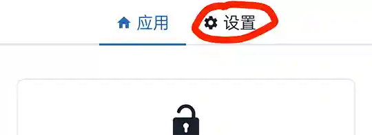
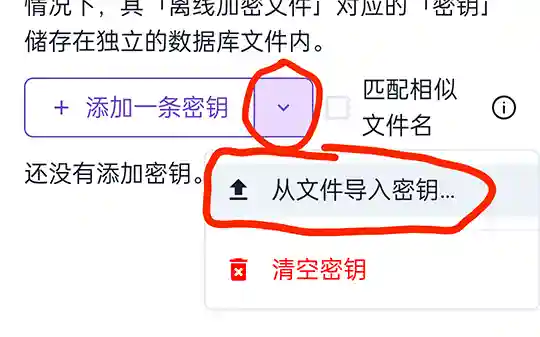
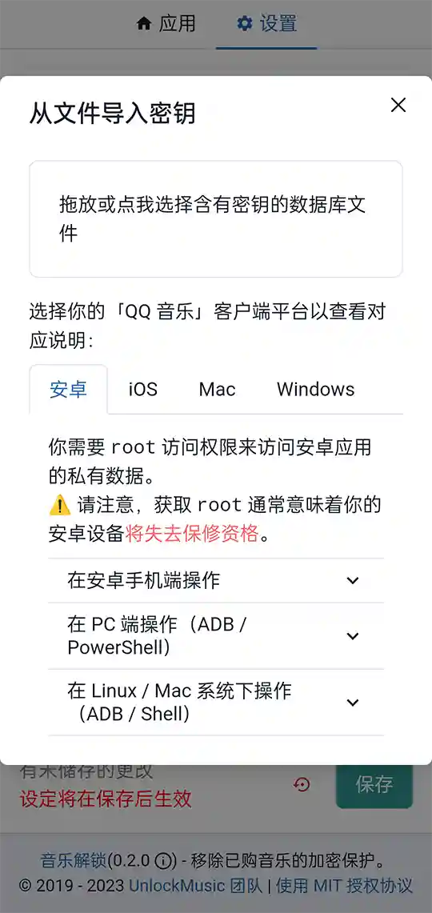

# 常见问题解答

## QQ 音乐

### 解锁失败

#### 1、请检查您的文件。

尝试用下载音乐的设备播放一次看看，如果 QQ 音乐都没法播放，那解锁肯定会受到影响哦。

#### 2、检查您的平台。

日前，<mark>仅 Windows 客户端</mark>下载的歌曲无需密钥，其余平台的官方正式版本均需要提取密钥。

> iOS 用户提取歌曲困难，建议换用电脑操作；Android 用户提取密钥需要 root，也建议用电脑操作。

> 重复下载同一首的歌曲**不重复扣下载配额**，但是*同一首歌的两个版本会重复扣下载配额*，请仔细分辨。

提取密钥教程请访问[新版解锁网站](https://um-react.netlify.app/)，前往网站内的设置 →“添加一条密钥”旁的<mark>**下拉按钮**</mark>→ 从文件导入密钥…→ 选择您对应的平台查看具体教程。

> 如果仍无法理解，可参考文末的图片操作

## 酷我音乐

### 解锁失败

酷我音乐的新版加密需要导入密钥。

#### 1、请检查您的文件。

尝试用下载音乐的设备播放一次看看，如果酷我音乐都没法播放，那解锁肯定会受到影响哦。

#### 2、检查您的平台。

日前，<mark>仅手机客户端</mark>下载的歌曲**至臻全景声**及**至臻母带**为新版加密，手机平台的其他音质暂时不需要提取密钥，PC 平台暂未推出使用新版加密的音质。

> Android 用户提取密钥需要 root，或者注入文件提供器。

提取密钥教程请访问[新版解锁网站](https://um-react.netlify.app/)，前往网站内的设置 →<mark>切换密钥为 KWMv2 密钥</mark>→“添加一条密钥”旁的<mark>**下拉按钮**</mark>→ 从文件导入密钥…→ 选择您对应的平台查看具体教程。

> 图片教程请参考 QQ 音乐（在文末），酷我音乐仅仅是需要切换一下密钥类型。

## 网易云音乐

### 解锁失败

您大概率正在使用 Windows 平台的网易云音乐 3.0 测试版。该版本对歌曲的信息新增了某些字段，导致旧版解锁识别错误。您可以找 1.10.5 版本的旧解锁网站，或者直接换[新版解锁网站](https://um-react.netlify.app/)。

> [旧解锁网站 Demo](https://demo.unlock-music.dev/)拥有者暂时联系不上，所以暂时无法更新。

## 其他问题

### 新版解锁网站解锁的歌曲没有封面

目前新版没有做歌曲信息匹配与编辑，所以歌曲如果自己没有写入歌曲信息，解出来就是没有的。

### 新版解锁网站没有批量下载

目前没有做。抱歉。

## 仍有问题？

欢迎进入[Telegram 交流群](https://t.me/unlock_music_chat)，一起探讨。

> QQ 音乐导入密钥的图片教程

1. 选择【设定】
    
2. 点击下拉菜单，选择【从文件导入密钥…】
    
3. 选择对应的客户端并查阅说明
    
